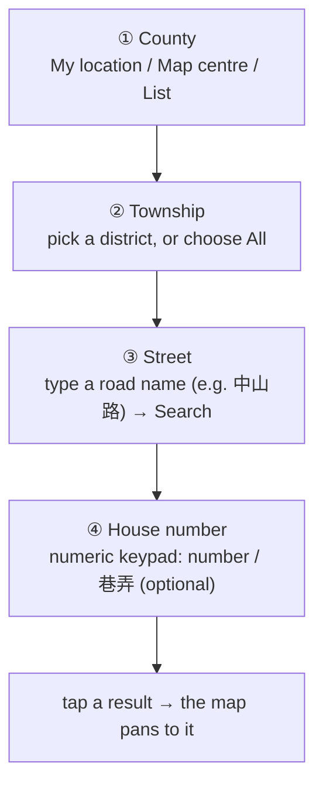

<!--
  End-user feature guide (English) for TW Addr Search (forward address search).
  Icons in docs/images are rendered from the real Android vector drawables by
  scripts/render-doc-icons.py — re-run it if the drawables change.
-->
# TW Addr Search — feature guide

> Type an address → find it on the map **offline** → jump there in one tap.
> Built for gloved use inside the ATAK tool panel.

**Feature:** 006 county-first forward search · 008 UI redesign | **Versions:** v1.1.0 → **v1.3.0** | **Targets:** ATAK-CIV 5.5.0 – 5.7.x | **Language:** English · [中文](tw-addr-search_zh.md)

---

## What does it do?

<table>
<tr>
<td width="150" valign="top" align="center">
<br>
<sub>Tools-menu icon<br>"TW Addr Search"</sub>
</td>
<td valign="top">

Turns an **address → coordinate**. You narrow it down layer by layer: pick the
county, pick the township (or "All"), type the street, then the house number, and
confirm to pan the map there.

- ✅ **Fully offline**: queries the address data you imported.
- ✅ **Big buttons, no system keyboard**: easy with gloves.
- ✅ **Distance-sorted + direction arrows**: nearest first, with the direction to
  each result.

> Its mirror-image sibling is **[TW Offline Addr](tw-offline-addr.md)** (a point
> on the map → shows its address).

</td>
</tr>
</table>

### Prerequisites

1. Get **`tw-central-full.zip`** (produced by
   [atak-tw-address-generator](https://github.com/swim-fish/atak-tw-address-generator)).
2. Import it on the **[TW Offline Addr](tw-offline-addr.md)** page, and **do not
   skip** `townships.sqlite`.
3. Confirm the **county** you want to search has been imported.

> 📦 The "**base data**" is the **`townships.sqlite`** county-boundary file
> (inside the zip); it is what decides the county/district. Without it this page
> shows "import the base data first". For sizes and required space see
> **[TW Offline Addr — getting the offline data pack](tw-offline-addr.md#getting-the-offline-data-pack-tw-central-fullzip)**.

### Screenshot UI is in Chinese — label glossary

The screenshots here show the app in Chinese. The English UI labels and their
Chinese equivalents:

| English (UI) | Chinese (screenshot) |
|---|---|
| My location | 所在地 |
| Map centre | 地圖中心 |
| List… | 清單… |
| Reset | 重設 |
| All / District | 全部 / 指定鄉鎮 |
| Search | 搜尋 |
| House number | 門牌號 |
| Clear / Done | 清除 / 完成 |
| Most similar / Distance | 最相似 / 距離 |

> The page is titled **Forward Search** in the English UI (referred to here as
> **TW Addr Search**).

---

## Opening it

ATAK **Tools menu** → tap the **TW Addr Search** icon  (a magnifier with a `tw` badge top-left).

---

## Four steps (the funnel)



### ① County

A county chip sits at the top, auto-filled from the map centre when the page
opens. Three buttons change it:

| Button | What it does |
|---|---|
| **My location** | the county of your current GPS position |
| **Map centre** | the county at the centre of the map (default) |
| **List…** | opens a scrollable **county pop-up** (all counties in the boundary), pick one |

> Tapping **Map centre / My location** also **auto-selects the township** it
> resolves (the district button shows the name and the scope flips to
> "District"), dropping you straight to street entry; it falls back to "All" when
> the district can't be resolved.

> 💡 The chip shows the **county only** (e.g. 「台中市」). In **List…**, counties
> with **no imported address data** are marked with **⚠** and dimmed — those have
> boundary data only and can't return streets.

<p align="center">
  <br>
  <sub>The <b>county pop-up</b> opened from "List…": ordered geographically (宜蘭 →
  north → down the west coast → 台東/花蓮 → outlying islands last), the <b>current
  county</b> highlighted with a blue outline (台中市 here), and counties with <b>no
  address data</b> marked <b>⚠</b> and dimmed.<br>Note: the list shows only the
  counties present in the <b>imported <code>townships.sqlite</code></b> — this is
  the central pack (12 counties); a national boundary shows all 22.</sub>
</p>

### ② Township

After a county is chosen, this stage is an **[ All │ District ]** toggle plus one
township button:

- **All** (default): no district filter, search the whole county. Pick a county
  and you can **type a street right away — no need to know the district**. The
  trade-off is that same-named streets (every district has a 「中山路」) all show
  up, so tell them apart by **distance and the direction arrow**.
- **District**: tapping it **opens a township picker** (large 3-per-row cells, ▶
  = the district suggested from your location); choose one and the search is
  scoped to that district — **fewer, most precise** results. The chosen district
  shows on the button, and the active toggle is marked with a **blue outline**.

```
(the picker that opens from "District")
┌────────┬────────┬────────┐
│  All   │  ▶中區  │  東區   │   ← ▶ = district suggested from your location
├────────┼────────┼────────┤
│  西區   │  南區   │  北區   │
├────────┼────────┼────────┤
│  北屯區 │  西屯區 │  南屯區 │
└────────┴────────┴────────┘
```

<p align="center">
  <br>
  <sub>Actual screen (① county + ② township + ③ street): the chip shows the
  <b>county</b> only (Taichung) with the three source buttons and "Reset" top-right;
  below, the <b>[ All │ District ]</b> toggle (here "All" is marked selected with a
  blue outline) and the button reads "whole county (no district)".</sub>
</p>

### ③ Street

Type a road name and tap **Search**:

- Substring match, including 段 (typing 「中山路」 brings up 一段, 二段, …).
- Handles **臺 ↔ 台** and full-width / half-width digits automatically.
- Addresses with no road name (located by 巷弄, e.g. 「介壽新村」「十甲巷」) can be
  found by typing the name directly.

### ④ House number (optional)

After searching, a **house-number field** appears below; **tapping it opens a
numeric keypad** to narrow further:

```
House number
optional · Done = whole street
┌─────┬─────┬─────┐
│  1  │  2  │  3  │
├─────┼─────┼─────┤
│  4  │  5  │  6  │
├─────┼─────┼─────┤
│  7  │  8  │  9  │
├─────┼─────┼─────┤
│  巷  │  0  │  弄  │   ← type 巷弄 numbers like "30巷5弄7號"
├─────┼─────┼─────┤
│  號  │  之  │  ⌫  │   ← 「之」 = the hyphen (e.g. 30 之 5)
└─────┴─────┴─────┘
   [ Clear ]     [ Done ]
```

- The result list **narrows live** as you type; **Clear** returns to the whole
  street, **Done** closes the keypad (the field keeps the number you entered).

<p align="center">
  <br>
  <sub>The <b>numeric keypad</b> that opens from the house-number field: titled
  「門牌號」 (House number), with <b>巷 / 弄 / 號 / 之 / ⌫</b> and "Clear / Done"
  below; behind it are the distance-sorted results, each with a direction arrow.</sub>
</p>

---

## Results & the direction arrow

Every result is prefixed with a **16-point compass arrow** showing the direction
of that address from your current reference point, followed by the distance:

```
↗ NE   臺中市西區中山路一段12號 · 230 m
→ E    臺中市西區中山路二段88號 · 540 m
↘ SE   臺中市西區中山路三段5號  · 1200 m
```

- **Arrow**: from the current reference point toward the address (north up,
  clockwise into 16 points).
- **Metres**: straight-line distance; results are sorted **nearest first**.
- **Reference point** defaults to the **map centre**; tapping **Map centre**
  updates it to the current centre, **My location** switches to your GPS
  position. Panning the map **across into a new county** updates it too. To reset
  the bearing/distance reference, tap **Map centre** or **My location** once.

<p align="center">
  <br>
  <sub>Actual screen (after searching 「西區・五權西路」): ② switched to
  <b>District</b> (blue outline), button reads 「西區」; ③ street 「五權西路」 with the
  house-number field and the <b>Most similar / Distance</b> sort toggle below;
  each result row is prefixed with a <b>16-point arrow + abbreviation</b>
  (<code>→ E</code>, <code>↓ S</code>, <code>↘ SSE</code>…), the <code>~</code>/<code>~~</code>
  confidence marker, and the distance.</sub>
</p>

### Pan to the target

**Just tap any result** and the map pans to that address — no other button
needed. The page stays open so you can tap another result or search again.

> ⚠️ The map only **pans, it does not auto-zoom**; if the target is off-screen,
> zoom out to see the drop point.

---

## Handy extras

| Feature | What it does |
|---|---|
| **Reset** | the top-right "Reset" button clears everything back to the map-centre initial state to start over. |
| **All** | choosing "All" in ② searches the whole county without needing to know the district first. |
| **Map-follow** | panning the map to a new county while the page is open updates the county and list automatically. |
| **巷弄 entry** | the keypad's 巷 / 弄 / 號 keys let you type a full house number without the system keyboard. |

---

## FAQ

**Q: It says "import the base data first".**
A: This feature needs `townships.sqlite` (county boundaries). Import the full ZIP
on **[TW Offline Addr](tw-offline-addr.md)** and make sure you didn't skip it.

**Q: A certain address isn't found.**
A: ① confirm that **county's data is imported**; ② if you picked the wrong
district, switch to "All"; ③ type just a fragment of the road name (e.g. 「中山」),
not the full name.

**Q: I tapped a result but the map didn't move.**
A: The map pans but **does not auto-zoom**; if the target is off-screen, zoom out
to see the drop point.

**Q: The arrow direction looks wrong.**
A: The arrow is relative to the "current reference point". Tap **Map centre** or
**My location** once to set the reference, and the bearing will be correct.

**Q: At sea / outlying islands / abroad, "Map centre / My location" can't get a
county.**
A: Outside Taiwan's county boundaries this is normal — the county can't be
auto-detected. Use **List…** to pick the county to search manually.

---

> Want the reverse — "what's the address of a point on the map"? See the
> **[TW Offline Addr guide](tw-offline-addr.md)**.
