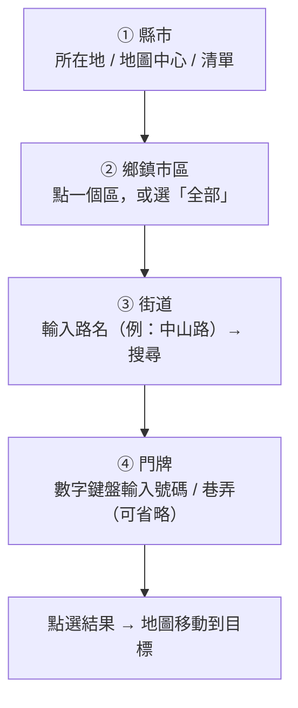

<!--
  End-user feature guide (zh-TW) for TW Addr Search (forward address search).
  Icons in docs/images are rendered from the real Android vector drawables by
  scripts/render-doc-icons.py — re-run it if the drawables change.
-->
# TW Addr Search（地址搜尋）— 功能介紹

> 打地址 → **離線**找到它在地圖上的位置 → 一鍵移動過去。專為戴手套、在 ATAK 工具面板裡操作而設計。

**對應功能：** 006 縣市優先前向搜尋 · 008 介面改版 ｜ **對應版本：** v1.1.0 → **v1.3.0** ｜ **適用：** ATAK-CIV 5.4.0 – 5.7.x ｜ **語言：** 中文 · [English](tw-addr-search.md)

---

## 這個功能在做什麼？

<table>
<tr>
<td width="150" valign="top" align="center">
<br>
<sub>Tools 選單圖示<br>「TW Addr Search」</sub>
</td>
<td valign="top">

把**地址 → 座標**。用一層一層縮小範圍的方式找地址：先選縣市、再選鄉鎮市區、再輸入街道、最後挑門牌，確認後把地圖移過去。

- ✅ **完全離線**：用你匯入的地址資料查詢。
- ✅ **大按鈕、不靠系統鍵盤**：戴手套也好按。
- ✅ **依距離排序 + 方位箭頭**：最近的排前面，並標出在你哪個方向。

> 它的反向兄弟功能是 **[TW Offline Addr](tw-offline-addr_zh.md)**（地圖位置 → 顯示地址）。

</td>
</tr>
</table>

### 前置需求

1. 取得 **`tw-central-full.zip`**（由 [atak-tw-address-generator](https://github.com/swim-fish/atak-tw-address-generator) 產生）。
2. 在 **[TW Offline Addr](tw-offline-addr_zh.md)** 頁面匯入，且**不要略過** `townships.sqlite`。
3. 確認要搜尋的**縣市**資料已匯入。

> 📦 「**base 資料**」即 **`townships.sqlite`** 縣市邊界檔（含在 zip 內），是判斷縣市/區的依據。沒有它，本頁會顯示「請先匯入 base 資料」。資料大小與所需空間見 **[TW Offline Addr — 取得離線地圖資料包](tw-offline-addr_zh.md#取得離線地圖資料包tw-central-fullzip)**。

### 介面語言對照（截圖為英文介面）

本頁截圖為英文 UI，內文用中文。對照如下：

| 中文（內文） | 英文（UI） |
|---|---|
| 所在地 | MY LOCATION |
| 地圖中心 | MAP CENTRE |
| 清單… | LIST… |
| 重設 | RESET |
| 全部 | All |
| 搜尋 | SEARCH |
| 前往 | GoTo |

> 頁名本身：內文稱 **TW Addr Search**，英文介面顯示為 **Forward Search / 前向搜尋**。

---

## 開啟方式

ATAK **Tools 選單** → 點 **TW Addr Search** 圖示 （左上角有 `tw` 標記，放大鏡造型）。

---

## 四個步驟（漏斗）



### ① 縣市

頂端有一個縣市晶片，開頁時用「地圖中心」自動帶入。三顆按鈕可改選：

| 按鈕 | 作用 |
|---|---|
| **所在地** | 用你目前 GPS 位置的縣市 |
| **地圖中心** | 用地圖中央的縣市（預設） |
| **清單…** | 從完整縣市清單挑 |

> 按 **地圖中心 / 所在地** 時，若能判斷出所在的鄉鎮市區，會**自動幫你選好那一區**（按鈕上會顯示該區名、切換鈕跳到「指定鄉鎮」），直接跳到街道輸入；判斷不出來時則退回「全部」。

> 💡 晶片只顯示**縣市**（例如「台中市」）。按 **清單…** 時，**沒有安裝地址資料**的縣市會標上 **⚠** 並變淡——這些縣市只有邊界資料，搜不到街道。

### ② 鄉鎮市區

選好縣市後，這一段是一個 **[ 全部 │ 指定鄉鎮 ]** 切換鈕加一顆鄉鎮按鈕：

- **全部**（預設）：不分區，整個縣市一起搜尋。選好縣市即可**直接打街道——不必知道在哪一區**。代價是同名街道（各區都有「中山路」）會一起出現，需靠**距離與方位箭頭**分辨。
- **指定鄉鎮**：點一下會**跳出鄉鎮市區選單**（每列 3 格的大格子，▶ 為依你位置建議的區），挑一個後只在該區裡找，**結果少、最精準**。選好的區會顯示在按鈕上，目前所選的切換鈕以**藍框**標示。

```
（點「指定鄉鎮」跳出的選單）
┌────────┬────────┬────────┐
│  全部   │  ▶中區  │  東區   │   ← ▶ = 系統依你的位置建議的區
├────────┼────────┼────────┤
│  西區   │  南區   │  北區   │
├────────┼────────┼────────┤
│  北屯區 │  西屯區 │  南屯區 │
└────────┴────────┴────────┘
```

<p align="center">
  <br>
  <sub>實際畫面（①縣市 + ②鄉鎮市區 + ③街道）：頂端晶片只顯示<b>縣市</b>（台中市）與三顆來源鈕、右上「重設」；下方 <b>[ 全部 │ 指定鄉鎮 ]</b> 切換（此圖「全部」以藍框標示為已選），右側按鈕顯示「整個縣市（免選鄉鎮）」。</sub>
</p>

### ③ 街道

輸入框輸入路名後按 **搜尋**：

- 子字串比對，含「段」（打「中山路」會帶出一段、二段…）。
- 自動處理 **臺 ↔ 台** 與全形／半形數字。
- 沒有路名的地址（用巷弄定位，如「介壽新村」「十甲巷」）也能直接打名稱找到。

### ④ 門牌（可省略）

搜尋後，下方會出現一個 **門牌欄位**；**點一下會跳出數字鍵盤**，可進一步縮小：

```
門牌號
可省略 · 直接按完成查整條街
┌─────┬─────┬─────┐
│  1  │  2  │  3  │
├─────┼─────┼─────┤
│  4  │  5  │  6  │
├─────┼─────┼─────┤
│  7  │  8  │  9  │
├─────┼─────┼─────┤
│  巷  │  0  │  弄  │   ← 可輸入「30巷5弄7號」這類巷弄門牌
├─────┼─────┼─────┤
│  號  │  之  │  ⌫  │   ← 「之」= 連字號（如 30 之 5）
└─────┴─────┴─────┘
   [ 清除 ]      [ 完成 ]
```

- 邊打**邊即時縮小結果**；按 **清除** 回到整條街、按 **完成** 收起鍵盤（門牌欄位會記住剛才輸入的號碼）。

<p align="center">
  <br>
  <sub>點門牌欄位跳出的<b>數字鍵盤</b>：標題「門牌號」、含 <b>巷／弄／號／之／⌫</b>，下方「清除 / 完成」；背後是依距離排序、每列前有方位箭頭的結果。</sub>
</p>

---

## 搜尋結果與方位箭頭

每一筆結果前面有一個 **16 方位箭頭**，指出該地址在你（目前基準點）的哪個方向，後面是距離：

```
↗ NE   臺中市西區中山路一段12號 · 230 公尺
→ E    臺中市西區中山路二段88號 · 540 公尺
↘ SE   臺中市西區中山路三段5號  · 1200 公尺
```

- **箭頭**：從目前基準點指向該地址的方位（北為上，順時針 16 等分）。
- **公尺**：直線距離；結果**由近到遠**排序。
- **基準點**預設為**地圖中心**；按「**地圖中心**」會更新到當下的地圖中心、按「**所在地**」改用你的 GPS 位置。平移地圖**跨到新縣市**時也會跟著更新。想重設方位/距離基準，按一次「地圖中心」或「所在地」即可。

<p align="center">
  <br>
  <sub>實際畫面（搜尋「西區・五權西路」後）：②切到 <b>指定鄉鎮</b>（藍框）、按鈕顯示「西區」；③街道輸入「五權西路」、下方為門牌欄位與 <b>最相似 / 距離</b> 排序切換；結果每列前有 <b>16 方位箭頭 + 縮寫</b>（<code>→ E</code>、<code>↓ S</code>、<code>↘ SSE</code>…）、信心度 <code>~</code>/<code>~~</code> 與距離。</sub>
</p>

### 移動到目標

**直接點選任一筆結果**，地圖就會平移到該地址 — 不需再按其他鈕。頁面保持開啟，方便你再點別筆或重新搜尋。

> ⚠️ 地圖只會**平移、不會自動縮放**；若目標落在畫面外，請自行縮小地圖即可看到落點。

---

## 好用的小功能

| 功能 | 說明 |
|---|---|
| **重設** | 右上角「重設」鈕，一鍵清空回到地圖中心初始狀態，重新開始。 |
| **全部** | ② 選「全部」可跨整個縣市搜尋，不必先知道在哪一區。 |
| **地圖跟隨** | 搜尋頁開著時平移地圖到新縣市，縣市與清單會自動更新。 |
| **巷弄輸入** | 鍵盤的 巷／弄／號 鍵讓你不靠系統鍵盤就能打出完整門牌。 |

---

## 常見問題

**Q：顯示「請先匯入 base 資料」？**
A：本功能需要 `townships.sqlite`（縣市邊界）。請到 **[TW Offline Addr](tw-offline-addr_zh.md)** 匯入完整 ZIP，並確認沒有略過該檔。

**Q：搜尋不到某地址？**
A：① 確認該**縣市資料已匯入**；② 區選錯了可改選「全部」；③ 路名只需打片段（如「中山」），不必完整。

**Q：點了結果地圖沒動？**
A：地圖會平移但**不會自動縮放**；若目標在畫面外，縮小地圖即可看到落點。

**Q：箭頭方向怪怪的？**
A：箭頭以「目前基準點」為原點。先按一次 **地圖中心** 或 **所在地** 設定基準，方位就會正確。

**Q：在海上／外島／國外，「地圖中心／所在地」帶不出縣市？**
A：超出台灣縣市邊界時屬正常現象，無法自動判斷縣市。請改用「**清單…**」手動選擇要搜尋的縣市。

---

> 想反過來「看地圖上某點是什麼地址」？請看 **[TW Offline Addr 功能介紹](tw-offline-addr_zh.md)**。
