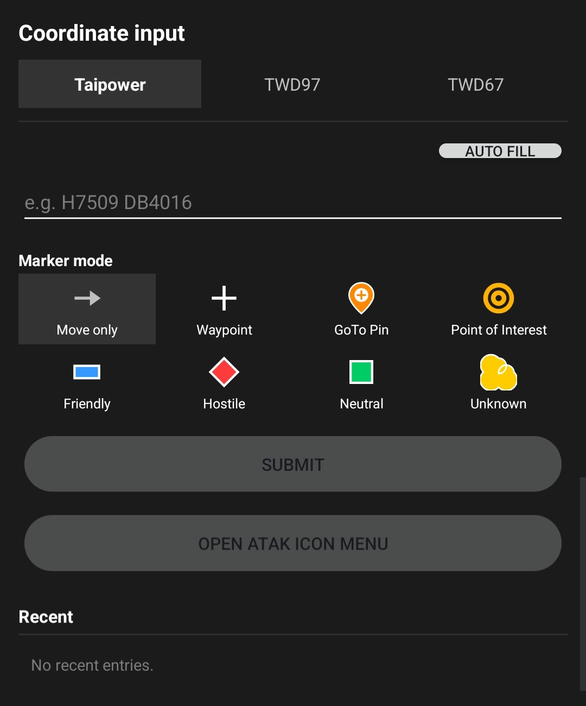

# TW Coordinates Plugin — 使用手冊

> **English version:** [user-guide.md](user-guide.md)

**對應版本：** v1.4.0 ｜ **對應 ATAK-CIV：** 5.5.0 — 5.7.x
**最新發行：** <https://github.com/swim-fish/atak_tw_coord_plugin/releases/latest>

這是精簡版。若你只是想把外掛裝起來用，看這份就夠了。需要更深入的背景知識（精度資訊、基準轉換內部原理、MIL-STD-2525 標記說明），請參閱 `docs/` 目錄下的其他原始文件。

---

## 目錄

1. [下載與安裝](#1-下載與安裝)
2. [確認載入成功](#2-確認載入成功)
3. [在 ATAK 中使用](#3-在-atak-中使用)
4. [設定](#4-設定)
5. [常見問題](#5-常見問題)

---

## 1. 下載與安裝

<table>
<tr>
<td width="280" valign="top"></td>
<td valign="top">

1. 到 [Releases 頁面](https://github.com/swim-fish/atak_tw_coord_plugin/releases/latest) 下載最新的 APK，檔名為 `ATAK-Plugin-TWCoord-vX.Y.Z-ATAK-5.5+.apk`。
2. 把 APK 側載到裝置上，二擇一：
   - 從工作站用 `adb install -r <apk>` 安裝，或
   - 把 APK 複製到裝置，再用檔案管理員點開。
3. ATAK 會跳出 **TAK Package Mgmt** 對話框，按下確認即可。

就這樣 — 沒有額外步驟，也不需要另外按「啟用」開關。外掛已在 ATAK 中生效。

> 從舊版升級嗎？直接 `adb install -r` 覆蓋即可。每個版本都使用相同的簽章憑證，Android 會保留你的設定與 Recent 清單。

</td>
</tr>
</table>

---

## 2. 確認載入成功

如果想在實際使用前先檢查：

- **Settings → Plugins**（或 **TAK Package Mgmt**）→ 找到 **TW Coordinates**，狀態應為 **Loaded**。
- 或直接打開 Tools 選單（下一節）。只要看到兩個 TW 開頭的項目，外掛就已運作中。

如果項目沒出現，強制停止 ATAK 後重開：

```
adb shell am force-stop com.atakmap.app.civ
```

---

## 3. 在 ATAK 中使用

外掛會把台灣座標輸入整合到 ATAK 原生的 **Go To** 對話框，並在
**Tools** 選單加入兩個項目。只需要快速跳到指定座標時使用原生對話框；
需要進階 GoTo 或地圖讀值功能時，再使用 Tools 項目。

<table>
<tr>
<td width="280" valign="top"></td>
<td valign="top">

打開 ATAK 的 **Tools** 選單（右下角工具列按鈕，或從邊緣滑入）。外掛新增了 **兩個** 項目：

-  **TW Coord GoTo** — 開啟具備 Marker mode、Recent 紀錄與 ATAK 圖示盤的進階側面板（§3.2）。
-  **TW Coordinates** — 開啟本外掛的設定頁，在那裡選擇地圖讀值小工具的座標系統並切換顯示／隱藏（§3.3）。_（v1.1.0 以前點此圖示會循環切換 台電 → TWD97 → TWD67 → 關閉；自 v1.2.0 起改為開啟設定頁，詳見 §3.3。）_

</td>
</tr>
</table>

### 3.1 ATAK Go To — 使用原生 Taiwan 座標輸入

自 v1.4.0 起，台灣座標系統會直接出現在 ATAK 標準座標輸入對話框中：

1. 開啟 ATAK 的 **Go To** 對話框，選擇 **Taiwan** 分頁。
2. 選擇 **Taipower（台電）**、**TWD97** 或 **TWD67**。
3. 輸入座標，或按 ATAK 的 **Auto Fill**，把 ATAK 目前提供的位置轉成所選格式。
4. 按 **OK**，由 ATAK 執行原本的 Go To 動作。

<p align="center">
<br>
<sub>ATAK Go To → Taiwan → Taipower。Taiwan 分頁直接使用 ATAK 原生對話框與動作按鈕。</sub>
</p>

- 台電座標接受 9 碼（10 m）或 11 碼（1 m）的本島格式。Auto Fill 與 Copy
  會產生標準化的 11 碼格式，例如 `H7509 DB4016`。
- TWD97 與 TWD67 使用整數公尺的 Easting、Northing。台灣本島選 **121**；
  外島選 **119**。
- **Clear** 只會清除目前選取的 Taiwan 草稿；**Copy** 會把標準化字串複製到
  剪貼簿，不會改變草稿。
- 最後的 Go To 或其他位置動作由 ATAK 負責。外掛只回傳水平 WGS84 座標，
  不會自行產生高度。
- 在 ATAK 的唯讀對話框中，座標仍可檢視與複製，但輸入欄位、座標系統與
  zone 選擇器都會停用。

<p align="center">
<br>
<sub>TWD97 使用分開的 Easting、Northing 欄位，並明確選擇 TM2 zone；TWD67 使用相同版面。</sub>
</p>

若只需要熟悉且快速的操作路徑，建議使用這個原生分頁。若需要 Marker
affiliation、ATAK 圖示盤或最近 10 筆輸入紀錄，請改用 **TW Coord GoTo**。
原生分頁與進階頁面的選項及草稿會分開保存，互不覆寫。

TWD67 zone 119 會顯示精度提醒。台電座標無法表示外島位置；此時 Auto Fill
會清除先前的台電草稿並回報涵蓋範圍限制，避免畫面留下過期座標。

### 3.2 TW Coord GoTo — 進階座標操作

<table>
<tr>
<td width="280" valign="top"></td>
<td valign="top">

按下 **TW Coord GoTo**，右側會滑出一個面板，以 segmented（分段）控制項選擇三種座標系統：**Taipower（台電）**、**TWD97**、**TWD67**。_（v1.3.2 將本頁改為與其他外掛頁面一致的「緊湊堆疊」手套友善版面 — 操作流程不變，控制項更清楚。）_

三個分頁的操作流程相同：

1. **輸入座標**（依各分頁的格式），或按面板標題列的 **帶入地圖中心** 鈕，把目前的地圖中心座標直接帶入當前分頁的欄位。
2. **（選用）挑選 Marker mode（標點模式）** — 以手套友善的 2×4 網格排列的 8 種選項：
   - *Move only*（預設 — 只平移地圖，不放標記）
   - *Waypoint*、*GoTo Pin*、*Point of Interest*
   - *Friendly*、*Hostile*、*Neutral*、*Unknown*（MIL-STD-2525 標準配色）
3. **按 送出並前往。** 地圖會平移到你輸入的座標。若 Marker mode 不是 *Move only*，會用 ATAK 原生的標記工具在該位置放一個標記 — 之後長按該標記即可從標準環形選單編輯、移動或刪除。

另一個放置按鈕：**改用 ATAK 圖示盤…** 會平移到座標後，把控制權交給 ATAK 原生的 Enter Location 面板，讓你從 ATAK 已安裝的任何 iconset / pallet 中選擇圖示。

每次成功送出都會記錄到 **Recent**（最多 10 筆，舊的先被擠掉）。點 Recent 列表的某一列可以把當時的輸入帶回欄位；點該列的 **×** 則只刪除那一筆。

</td>
</tr>
</table>

### 3.3 TW Coordinates — 地圖讀值小工具

<table>
<tr>
<td width="280" valign="top"></td>
<td valign="top">

啟用讀值後，地圖右側邊緣會顯示兩行：

- **ME TPC: …** — 你目前所在位置
- **MAP TPC: …** — 目前的地圖中心位置

兩行都會依你在 **設定** 中選的座標系統來呈現——台電 / TWD97 / TWD67（§4）。在 Tools 選單點擊 **TW Coordinates** 現在會**開啟該設定頁**，不再每點一下就循環切換格式。若要完全隱藏讀值，請到設定關閉 **Show on-map readout（顯示地圖讀值）**。

</td>
</tr>
</table>

---

## 4. 設定

<table>
<tr>
<td width="280" valign="top"></td>
<td valign="top">

開啟方式：ATAK → **Settings**（齒輪圖示）→ **Tool Preferences** → **Specific Tool Preferences** → **TW Coordinates**。

你可以調整以下項目，再加一個捷徑按鈕：

- **Display unit** — 決定地圖讀值小工具使用的座標系統：台電 / TWD97 / TWD67。這現在是切換格式的唯一入口——點擊 **TW Coordinates** Tools 圖示會開啟此頁，而非循環切換格式（§3.3）。
- **Show on-map readout（顯示地圖讀值）** — 顯示或隱藏地圖上的座標讀值小工具。取代了舊版「持續點擊 Tools 圖示直到 *Off*」的做法。
- **Address search result order（位址搜尋結果排序）** — 將 TW Addr Search 的結果依 *距離* 或 *最相似（文字比對）* 排序（也可在搜尋頁面上直接切換）。
- **UI language** — 強制此外掛的介面字串使用 *系統語系* / *英文* / *中文（正體）* / *日文*。只影響本外掛，不會動到 ATAK 其他部分。
- **Open Coordinate Input** *(按鈕)* — 等同於 Tools → TW Coord GoTo 的捷徑。

頁面下方還有一塊唯讀的 **Accuracy notice（精度說明）**，整理了誤差範圍（TWD97< 1 m、TWD67 本島 ±3–5 m / 外島 ±10–20 m、台電網格僅支援本島）。純參考資訊，不需要操作。

</td>
</tr>
</table>

---

## 5. 常見問題

**Q：Tools 選單裡沒看到外掛？**
到 **Settings → Plugins** 確認狀態是 *Loaded*。若不是，先強制停止 ATAK（`adb shell am force-stop com.atakmap.app.civ`）再重開。若還是消失，把 APK 移除後重裝。

**Q：升級時需要先移除舊版嗎？**
不需要，用 `adb install -r` 直接覆蓋即可。每個版本使用相同簽章憑證，設定與 Recent 紀錄都會保留。

**Q：讀值顯示 `out of range`？**
代表你目前選的是 *台電網格*，但地圖中心落在外島（澎湖 / 金門 / 馬祖），那裡不在台電網格涵蓋範圍內。改用 TWD97 或 TWD67 即可。

**Q：怎麼刪掉透過 SUBMIT 放下的標記？**
長按該標記 → ATAK 標準環形選單 → 垃圾桶圖示。這是 ATAK 原生行為，外掛沒有額外客製。

**Q：要在哪裡看建置 / 簽章 / 資安掃描的證據？**
每個 GitHub Release 都會附上 R8 mapping 檔、Fortify SAST 報告 PDF、OWASP dependency-check HTML 報告、以及提交給 TAK TPP 的原始碼壓縮檔。

---

**回報問題：** <https://github.com/swim-fish/atak_tw_coord_plugin/issues>
**版本列表：** <https://github.com/swim-fish/atak_tw_coord_plugin/releases>
