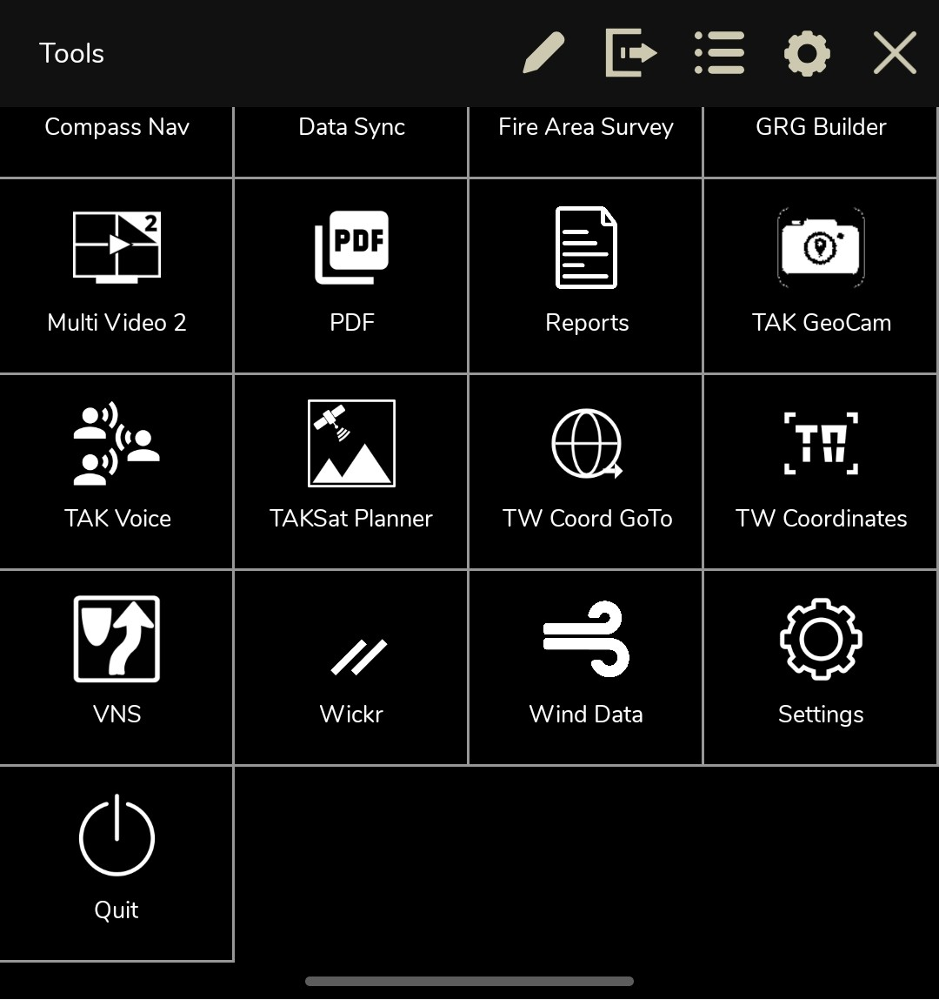

# TW Coordinates Plugin — 使用手冊

**對應版本：** v1.5.1

**語言：** [English](user-guide.md) · 正體中文

TW Coordinates 為 ATAK 加入台灣座標與離線地址功能。座標與地址輸入已
整合至 **ATAK 原生 GoTo Taiwan**；此外掛在 Tools 選單只保留
**TW Coordinates**，用來管理離線資料與開啟設定。

## 選擇要完成的工作

| 我想要…… | 從這裡開始 |
|---|---|
| 安裝外掛並確認載入成功 | [首次設定](#首次設定) |
| 前往台電、TWD97 或 TWD67 座標 | [前往台灣座標](#前往台灣座標) |
| 不連網搜尋台灣地址 | [前往離線地址](#前往離線地址) |
| 查看地圖圖示的台灣座標格式 | [轉換地圖圖示的座標](#轉換地圖圖示的座標) |
| 匯入、取代或移除地址資料 | [管理離線地址資料](#管理離線地址資料) |
| 顯示、複製或設定地圖讀值 | [使用與設定地圖讀值](#使用與設定地圖讀值) |
| 排除操作問題 | [疑難排解](#疑難排解) |

## 外掛如何整合至 ATAK

目前有三個入口：

| ATAK 路徑 | 用途 |
|---|---|
| **Go To → Taiwan** | 輸入台電、TWD97、TWD67 或已匯入的地址 |
| 地圖圖示詳細資料 → **Coordinate** → **Taiwan** | 查看圖示座標與附近的離線地址 |
| Tools → **TW Coordinates** | 管理離線資料，再開啟外掛設定 |

Go To 對話框、**Auto Fill**、**Clear**、**Copy** 與最後確認皆由 ATAK
控制；此外掛提供 Taiwan 頁面，並在裝置本機執行轉換或查詢。

## 首次設定

### 前置條件

- 符合目標 ATAK 簽章版本的 APK。
- 只有地址搜尋或地址讀值需要離線地址資料包；單純轉換座標不需要資料集。

### 安裝與驗證

1. 安裝外掛 APK。
2. 開啟 ATAK，依提示啟用 **TW Coordinates**。
3. 開啟 **Settings → Plugins** 或 **TAK Package Mgmt**，確認外掛狀態為
   **Loaded**。
4. 開啟 ATAK **Go To**，確認可選擇 **Taiwan**。
5. 開啟 Tools，確認此外掛只顯示 **TW Coordinates**。

同時看到 **Taiwan** 頁面與 **TW Coordinates** Tools 項目，即表示首次
設定完成。

升級通常會保留已匯入的縣市資料集與目前設定。若升級後仍看到舊版 Tools
項目，請重新載入或重啟 ATAK，讓 ATAK 更新快取。

## 前往台灣座標

1. 開啟 ATAK **Go To → Taiwan**。
2. 選擇**台電座標**、**TWD97** 或 **TWD67**。
3. 輸入座標：

   | 系統 | 必填內容 |
   |---|---|
   | 台電座標 | 本島代碼，例如 `H7509 DB40`（9 碼、10 m）或 `H7509 DB4016`（11 碼、1 m） |
   | TWD97 | 整數公尺的東向與北向座標，以及 TM2 分帶 121 或 119 |
   | TWD67 | 整數公尺的東向與北向座標，以及 TM2 分帶 121 或 119 |

4. 輸入台電座標時，依資料來源選擇版面：

   使用台電列最右側的模式切換按鈕；按鈕文字會顯示即將切換到的版面。

   - **單欄輸入**適合直接輸入或貼上完整代碼。
   - **分欄輸入**會把同一組代碼拆成 `H`／`7509`／`DB`／`40` 或
     `4016`。前三欄輸入完整後會自動前往下一欄；最後輸入兩碼後仍會
     保持焦點，可再補兩碼改成 1 m 精度。

5. 依 Taiwan 頁面的驗證訊息修正輸入。百公尺第一碼英文須為 A-H，
   第二碼英文須為 A-E。無效英文字母會保留在欄位中供修正，但不會
   產生座標點。
6. 按 ATAK 的 **OK** 執行 Go To。

 
目前是單欄輸入。按最右側的 <strong>Guided fields</strong>，即可把同一份草稿切換成四個引導欄位；座標值已遮蔽。

 
分欄輸入依序拆成英文區域碼、四碼數字、兩碼百公尺英文與二碼或四碼精度數字。按 <strong>Single field</strong> 可切回單欄，座標不會改變；畫面值已遮蔽。

ATAK 接受座標並移至指定位置，即表示完成。121 分帶用於本島；119 分帶
用於適用的外島位置。台電座標只支援本島；TWD67 的 119 分帶會顯示精度
提醒。

點選欄位時只會顯示一般行內鍵盤，不會離開 Go To 畫面。**下一步**只會
移動到 Taiwan 頁面內的下一個欄位；**完成**只會收起鍵盤，不會確認位置
或移動地圖。

涵蓋範圍與精度限制請參閱
[座標系統、涵蓋範圍與精度](reference/coordinate-systems.md)。

### 使用 ATAK 控制項

- **Auto Fill**：按一次即可將 ATAK 目前位置補入全部四個 Taiwan 頁籤，並保留
  目前選取的頁籤；Address 可能會短暫顯示離線查詢進度。
- **Clear**：只清除目前頁籤；在 Address 頁籤也會取消目前查詢與候選結果。
- **Copy**：複製目前頁籤的標準表示方式，不會移動地圖。

## 前往離線地址

### 前置條件

先匯入邊界資料，以及包含目標地址的縣市資料集。尚未安裝資料時，請先參閱
[管理離線地址資料](#管理離線地址資料)。

### 搜尋並確認地址

1. 開啟 ATAK **Go To → Taiwan → Address**。
2. 要貼上或輸入完整地址時使用**單欄輸入**；需要明確指定欄位時切換為
   **分欄輸入**。
3. 使用分欄輸入時，第一列以相同寬度並排縣市與鄉鎮市區；第二列以相同
   寬度並排道路地名與門牌樓層。
4. 等待裝置完成離線搜尋。
5. 若解析出一筆地址，先檢查內容；若顯示**有多筆相符地址**，請按
   **選擇結果**，依行政區與道路資訊選取正確資料。
6. 按 ATAK 的 **OK** 執行 Go To。

ATAK 接受解析後的地址並移至該位置，即表示完成。只選取候選結果不會移動
地圖；必須再由 ATAK 原生確認。

單欄與分欄模式共用同一份草稿，切換時不會遺失輸入。常見的 `台`／`臺`、
全形數字、空白、標點與地址單位數字差異，會在裝置本機正規化。

 
貼上或輸入完整地址時使用單欄輸入；地址內容已遮除。

 
分欄輸入的第一列以 1:1 並排縣市與鄉鎮市區，第二列以 1:1 並排道路地名與門牌樓層；最右側的 <strong>Single field</strong> 可切回單欄，地址值已遮除。

若尚未安裝相符資料集，Address 會顯示資料管理提示，但其他座標頁籤仍可
使用。候選行為與完整範例請參閱
[原生 Taiwan Address 功能介紹](tw-addr-search_zh.md)。

## 轉換地圖圖示的座標

1. 開啟地圖圖示詳細資料。
2. 點選 **Coordinate** 座標值。
3. 在 **Convert Coordinate** 選擇 **Taiwan**。
4. 切換**台電座標**、**TWD97**、**TWD67** 與 **Address**。

三種座標會立即準備；Address 會以圖示的精確 WGS84 位置非同步查詢。
畫面可能顯示附近門牌，但此外掛不會用該門牌資料點取代或吸附 ATAK
原始位置。

看到所需的台灣座標表示方式，且圖示原始位置未改變，即表示完成。

 
點選 Coordinate 開啟 Convert Coordinate。

 
Taiwan 會出現在 ATAK 內建座標頁面旁。

若 ATAK 主對話框為唯讀，仍可查看解析結果，但輸入框、選擇器與候選操作
會停用。

## 管理離線地址資料

開啟 Tools → **TW Coordinates**。這是此外掛唯一的公開 Tools 項目，
會直接開啟離線資料管理頁。

 
座標與地址輸入整合至 ATAK 原生 GoTo Taiwan；Tools 只保留 TW Coordinates，用於管理資料與設定。

### 匯入資料

1. 按 **Import…／匯入…**。
2. 選擇支援的 ZIP 資料包或 SQLite 資料集。
3. 顯示進度卡時保持 ATAK 開啟。
4. 確認匯入的縣市列出資料日期、筆數與容量。

邊界資料與適用縣市都成為啟用中資料後，即可使用地址搜尋與地址讀值。

### 取代或移除縣市

- 要更新縣市資料時，點該列的 **⋮**，選擇 **Replace…／取代…**，再選擇
  新版檔案。只有取代成功後才會停用舊資料。
- 要釋放空間時，點 **⋮**，選擇 **Remove／移除**並確認。此動作會刪除
  該縣市目前啟用的本機資料；需要恢復時必須重新匯入。

 
Tools 項目會開啟此管理頁；頂端按鈕可開啟 TW Coordinates 設定。

支援的資料包、空間規劃、狀態欄位與匯入錯誤復原請參閱
[離線地址資料](tw-offline-addr_zh.md)。

## 使用與設定地圖讀值

此外掛可顯示下列座標讀值：

| 標籤 | 代表位置 |
|---|---|
| **MAP** | 地圖中心 |
| **ME** | 自身位置 |
| **TGT** | 選取目標 |

每列會使用目前選定的台電、TWD97 或 TWD67 格式。點選座標讀值即可複製
畫面上的完整字串。選用的地址列會顯示最接近的已匯入地址、方向箭頭，以及
`~`／`~~` 信心標記。

可從任一路徑開啟設定：

- Tools → **TW Coordinates** → **TW Coordinates 設定**
- **Settings → Tool Preferences → Specific Tool Preferences → TW Coordinates**

設定包含顯示格式、MAP／ME／TGT 顯示狀態、地址列、信心門檻、Address
候選排序與外掛介面語言。變更後會立即重新繪製讀值，不必重啟 ATAK。

## 疑難排解

| 現象 | 檢查與復原方式 | 成功判斷 |
|---|---|---|
| Tools 找不到 **TW Coordinates** | 確認外掛狀態為 **Loaded**；升級後重新載入或重啟 ATAK。 | Tools 出現一個 **TW Coordinates** 項目。 |
| Go To 找不到 **Taiwan** | 確認外掛狀態為 **Loaded**，再重新開啟 Go To 或重啟 ATAK。 | ATAK 座標頁面旁出現 **Taiwan**。 |
| Address 顯示沒有相符資料集 | 開啟 **TW Coordinates**，匯入邊界資料與適用縣市。 | 縣市顯示為啟用中，Address 可搜尋。 |
| Address 出現多筆結果 | 按**選擇結果**，比對縣市、行政區、道路與門牌。 | 選取結果完成解析，可交由 ATAK 確認。 |
| Address 找不到結果 | 確認已匯入正確縣市，再改用**分欄輸入**明確指定行政區。 | 解析出一筆結果或顯示相關候選清單。 |
| 讀值有座標但沒有地址 | 確認縣市資料為啟用中，並在設定開啟對應的 MAP／ME／TGT 地址列。 | 點位位於已安裝涵蓋範圍時顯示地址。 |
| 台電座標顯示百公尺英文字母錯誤 | 將第一碼英文修正為 A-H，第二碼英文修正為 A-E；分欄輸入會保留原字母供修正。 | 驗證訊息消失並可解析座標。 |
| 台電座標顯示 `out of range` | 台電網格只支援本島；適用位置請改用 TWD97/TWD67 的 119 分帶。 | 以支援的座標系統顯示該點。 |
| 匯入失敗 | 保留現有資料，依畫面錯誤檢查空間與資料包相容性後重試。 | 縣市顯示為啟用中資料。 |

所有座標轉換與地址查詢都在裝置本機完成，不需要網路。

## 延伸資訊

- [說明資料索引](README.md)
- [原生 Taiwan Address 功能介紹](tw-addr-search_zh.md)
- [離線地址資料功能介紹](tw-offline-addr_zh.md)
- [座標系統、涵蓋範圍與精度](reference/coordinate-systems.md)
- [目前 UI 契約](ui/README.md)
- [回報問題](https://github.com/swim-fish/atak_tw_coord_plugin/issues)
