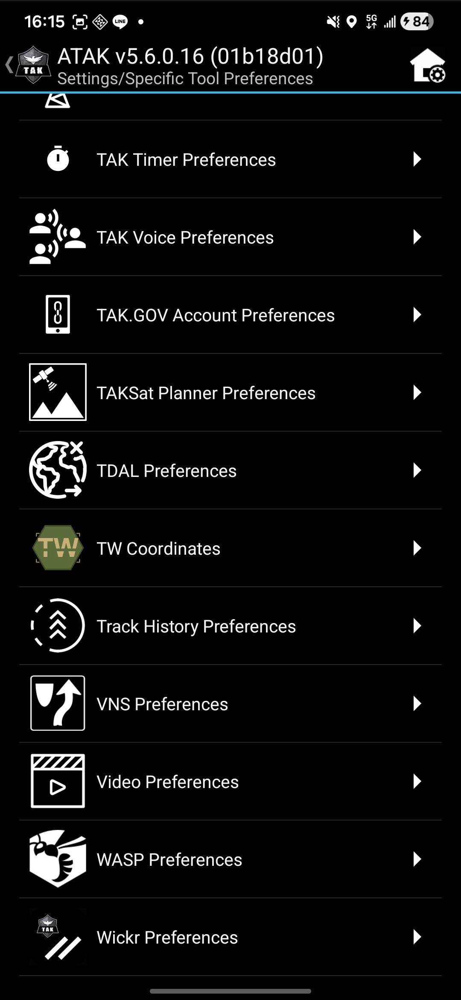
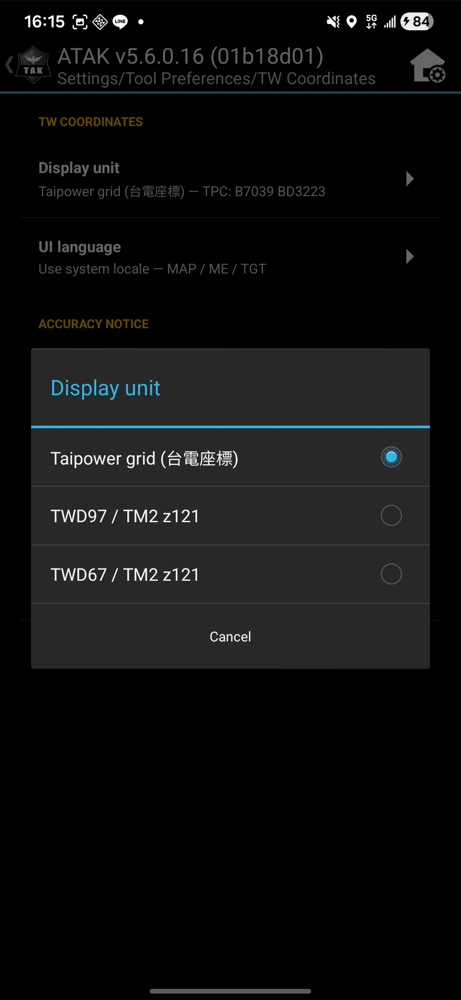

# TW Coordinates Plugin — 技術操作手冊

> **English version:** [user-guide.md](user-guide.md)

**對應版本：** v1.0.1 ｜ **對應 ATAK-CIV：** 5.4.0 — 5.7.x
**Plugin Package：** `com.atakmap.android.twcoord.plugin`
**簽章主體：** TAK Product Center ATAK Untrusted Plugin Release
**最新發行：** <https://github.com/swim-fish/atak_tw_coord_plugin/releases/latest>

本手冊以實機操作截圖為主，依序帶你完成「安裝 → 設定 → 地圖讀值 → 座標輸入跳轉」全套流程。每一節對應一張螢幕畫面，所有圖檔位於 `docs/images/`。

---

## 目錄

1. [安裝與授權](#1-安裝與授權)
   1. [於 TAK Package Mgmt 確認安裝](#11-於-tak-package-mgmt-確認安裝)
   2. [檢視 plugin 證書與後設資料](#12-檢視-plugin-證書與後設資料)
2. [基本設定](#2-基本設定)
   1. [進入 TW Coordinates 設定頁](#21-進入-tw-coordinates-設定頁)
   2. [設定總覽](#22-設定總覽)
   3. [切換顯示座標單位（Display unit）](#23-切換顯示座標單位display-unit)
   4. [切換介面語言（UI language）](#24-切換介面語言ui-language)
3. [地圖上的座標讀值](#3-地圖上的座標讀值)
4. [Tools menu — 兩個入口](#4-tools-menu--兩個入口)
5. [座標輸入頁（Coordinate Input）](#5-座標輸入頁coordinate-input)
   1. [Taipower 分頁（台電座標）](#51-taipower-分頁台電座標)
   2. [TWD97 分頁](#52-twd97-分頁)
   3. [TWD67 分頁](#53-twd67-分頁)
   4. [Auto Fill — 從地圖中心自動填入](#54-auto-fill--從地圖中心自動填入)
   5. [Marker mode — 8 種落點類型](#55-marker-mode--8-種落點類型)
   6. [SUBMIT vs OPEN ATAK ICON MENU](#56-submit-vs-open-atak-icon-menu)
   7. [Recent — 最近輸入紀錄](#57-recent--最近輸入紀錄)
6. [精度與覆蓋範圍備註](#6-精度與覆蓋範圍備註)
7. [常見問題](#7-常見問題)

---

## 1. 安裝與授權

### 1.1 於 TAK Package Mgmt 確認安裝

從 GitHub Releases 下載 `ATAK-Plugin-TWCoord-v1.0.1-ATAK-5.4+.apk`，以 `adb install -r <apk>` 或裝置端檔案管理器側載安裝。安裝完成後 ATAK 通常會自動彈出 **TAK Package Mgmt** 的授權對話框。


對話框內容：

| 欄位 | 內容 |
| --- | --- |
| Title | `TW Coordinates` |
| Description | `Display map-centre and own-position coordinates in Taipower / TWD97 / TWD67 units.` |
| 狀態列 | `TW Coordinates v1.0.1 () - [5.4.0] (1) is loaded and current` |

確認資訊無誤後按 **More Details** 進一步檢視（下一節），或關閉對話框直接使用。**Uninstall** 按鈕用於移除 plugin。

> 第一次安裝會看到「third-party plugin」信任提示。**之後升級（同一把簽章）** 不會再跳，可以 `adb install -r` 原地覆蓋。

---

### 1.2 檢視 plugin 證書與後設資料

在前述對話框點 **More Details**，會展開完整資訊。


關鍵欄位：

| 欄位 | 內容 |
| --- | --- |
| Product Type | `ATAK Plugin` |
| Package | `com.atakmap.android.twcoord.plugin` |
| Install Date / Update Date | 安裝與最近更新時間（UTC） |
| Local Device — Version | `1.0.1 () - [5.4.0] (1)` |
| TAK Requirement | `com.atakmap.app@5.4.0.CIV`（targets 5.4 以上） |
| Update Availability | `Sideloaded plugins` / `Current` |
| OS Suggested Version | `Android 8.0 (Oreo)` 以上 |
| 驗證列 | `The signature for the plugin is VALID` ✓<br>`ATAK Core: Release Plugin: Release` ✓ |

點 **Certificate** 按鈕可看完整 X.509 證書內容，預期顯示：

```
Issuer / Subject: CN=TAK Product Center ATAK Untrusted Plugin Release,
                  OU=Product Center, O=TAK, L=Fort Belvoir,
                  ST=Virginia, C=US
Signature Algorithm: sha384WithRSAEncryption
Public Key Algorithm: rsaEncryption, 4096-bit RSA
SHA-256 fingerprint: f24a3805 7275fcec f67be975 ab803d12
                     f75dc235 81bef69c ba9eb03a 15bb8c17
```

此證書由 TAK Third Party Pipeline 簽發，是任何「非第一方 TAK Product Center build」的 plugin 共用簽章。若指紋對不上，**請勿安裝** —— 代表 APK 來源被竄改。

---

## 2. 基本設定

### 2.1 進入 TW Coordinates 設定頁

ATAK → **Settings**（齒輪圖示）→ **Tool Preferences** → **Specific Tool Preferences**，在列表中找到 **TW Coordinates**（六角形板 + 白底 TW 字樣 + 角落兵棋括號）。



點該項進入設定頁。

---

### 2.2 設定總覽


設定頁分三個區塊：

**TW COORDINATES**（可變更）

| 項目 | 預設值 | 說明 |
| --- | --- | --- |
| **Display unit** | `Taipower grid (台電座標)` | 地圖右上 readout widget 顯示哪一套座標系統 |
| **UI language** | `Use system locale` | 影響 plugin 自身字串（系統 locale / 英 / 繁中 / 日） |

**ACCURACY NOTICE**（唯讀）

- **TWD97**：error < 1 m，全覆蓋區一致
- **TWD67**：主島 ±3–5 m，外島（澎湖 / 金門 / 馬祖）±10–20 m
- **Taipower 台電格** 僅覆蓋主島；外島定位時會顯示 *out of range* + WGS84 fallback 行

**Open Coordinate Input**（捷徑）

直接開啟 [§5 座標輸入頁](#5-座標輸入頁coordinate-input)，等同於 Tools menu 的 *TW Coord GoTo* 入口。

---

### 2.3 切換顯示座標單位（Display unit）

點 **Display unit** 列，跳出選擇對話框：



三選一：

| 選項 | Readout 顯示範例（單位由 plugin 自家 formatter 產出） |
| --- | --- |
| **Taipower grid (台電座標)** | `G5342 HE7592`（1 字母 + 4 數字區塊 + 空白 + 2 字母 + 2 或 4 數字格內位置；10 m 精度共 10 字元，1 m 精度共 12 字元） |
| **TWD97 / TM2 z121** | `214,000m 2,671,243m`（東距 + 北距，以公尺呈現並依 locale 加千分位）|
| **TWD67 / TM2 z121** | `213,915m 2,670,418m`（與 TWD97 同格式；同地點數值會因 TWD67 datum 平移而**不同**，主島約差 ±3–5 m） |

> **z119 對應外島**（澎湖 / 金門 / 馬祖）的中央經線 119°。Plugin 會根據地圖中心經度自動切換 z121 / z119，無需手動指定；切到 z119 時範例會多一段「` z119`」尾標：`214,000m 2,671,243m z119`。

選好後對話框立刻收起，readout widget 立刻刷新。

---

### 2.4 切換介面語言（UI language）

點 **UI language** 列，跳出選擇對話框：


四選一：

| 選項 | 影響範圍 |
| --- | --- |
| **Use system locale** | 跟著 Android 系統語言（裝置系統設定為何就是何）|
| **English** | 強制英文 |
| **中文（正體）** | 強制台灣正體中文 |
| **日本語** | 強制日文 |

此設定僅影響 *本 plugin* 自身的字串（readout widget、設定頁、座標輸入頁）；ATAK 主介面、其他 plugin 不受影響。

---

## 3. 地圖上的座標讀值

回到主地圖。Readout widget 顯示在畫面右側、半透明黑色背景：


讀值分為**自身位置（own position）**與**地圖中心（map centre）**兩組，**本 plugin 只負責這兩組的座標 readout**（依 §2.3 設定為 Taipower / TWD97 / TWD67 其中一種）；截圖內其他欄位都來自別處：

- `BX5ACK` 等 callsign、UTM `51R TG ...`、高度 `... m HAE`、速度 `... km/h`、磁方位 `°M EST` 等 → **ATAK 主程式內建** HUD
- 截圖中那組 `TWD97 E 214000 N 2671243` → 來自**另一支 TDAL plugin**（左側工具列含地球叉叉圖示那顆），不是本 plugin 輸出
- Eye Alt（視角高度） → ATAK 內建

| 位置 | 範例（截圖內容） | 對應 |
| --- | --- | --- |
| 自身位置（callsign = `魷魚 BX5ACK`，own marker） | **`ME TPC: G5342 HE7419`** | 自身所在的台電格 |
| 地圖中心 | **`MAP TPC: G5342 HE7592`** | 目前地圖中心的台電格 |

> 兩組座標的格式（台電 / TWD97 / TWD67）隨 §2.3 的 **Display unit** 設定切換。當 GPS 訊號超過閾值（預設 10 秒）沒更新，readout 字色會由白轉淡黃，標示為 stale fix。

地圖上的 **ATAK 標準 radial menu**（長壓地圖出現，圖中黑色圓盤含八個指令）跟 plugin 無關，但會與 §5.5 的 Marker mode 落點互動 — 落下的 marker 可用 radial 編輯 / 刪除 / 加入路線等。

---

## 4. Tools menu — 兩個入口

從 ATAK 工具列右下角 **Tools** 按鈕（或螢幕邊緣滑入）打開 Tools menu：


Plugin 註冊了兩個 Tools-menu 入口（圖示為 vector XML，ATAK 在執行階段以白色 tint mask 套色 — 下方獨立預覽由 `scripts/render-doc-icons.py` 從本專案 vector 設計直接渲染）：

| 圖示 | 名稱 | 功能 |
| --- | --- | --- |
|  | **TW Coord GoTo** | 開啟座標輸入頁（§5）|
|  | **TW Coordinates** | 切換 readout widget 的顯示單位（循環：Taipower → TWD97 → TWD67 → Off → Taipower …） |

> 兩個圖示在 Tools menu 都以白色 silhouette 呈現 — ATAK 對 tool icon 採 tint mask 著色，所以圖案必須是純線條 + 透明背景才能正確顯示。Plugin manager 與 Settings 入口的 TW 圖示則為彩色版本（OD 六角板）。

---

## 5. 座標輸入頁（Coordinate Input）

從 Tools menu 點 **TW Coord GoTo**，或從設定頁點 **Open Coordinate Input**，會打開右側的座標輸入面板（DropDown）。畫面內容可上下滑動，小螢幕也能完整觸及所有按鈕（v1.0.1 修正）。

### 5.1 Taipower 分頁（台電座標）


| 元件 | 說明 |
| --- | --- |
| **分頁列** | `Taipower` / `TWD97` / `TWD67`（深色 = 目前選中） |
| **Auto Fill 按鈕** | 從地圖中心位置自動填入（§5.4）|
| **輸入欄** | `H7509 DB4016` 格式 — 1 字母 + 4 數字 (5x5km 區塊) + 空白 + 字母字母數字數字 + 選填數字數字（10m / 1m 解析度）|
| **Marker mode** | 8 種落點類型（§5.5）|
| **SUBMIT** | 主動作 — 平移地圖到該座標，依 Marker mode 決定是否落 marker（§5.6） |
| **OPEN ATAK ICON MENU** | 委派給 ATAK 原生 Enter Location pane，由你在那邊挑 pallet / icon 落點 |
| **Recent** | 最近 10 筆成功提交紀錄（§5.7） |

解析器會先把輸入正規化（剝掉空白與成對括號、全大寫），然後要求結果**恰好 9 字元（10 m 精度，例如 `H7509DB40`）或 11 字元（1 m 精度，例如 `H7509DB4016`）**。日常輸入一般會在區塊代碼後留個空格方便閱讀（`H7509 DB40` 或 `H7509 DB4016`），帶或不帶空白都會被接受。任何不符這兩種長度的輸入會在欄位下方即時顯示紅字錯誤。

---

### 5.2 TWD97 分頁


差異點：

| 元件 | 說明 |
| --- | --- |
| **Easting (m)** 與 **Northing (m)** | 兩個整數欄位，並排於同一橫列 |
| **Zone** | `121 (main island)` / `119 (outer island)` 二選一 |

選錯 zone（例如台灣本島座標卻選 119）會在輸入欄底下顯示橘色 advisory。

---

### 5.3 TWD67 分頁


版面與 TWD97 完全相同，差別在於後端會套用 4 參數 Bursa-Wolf datum shift 將 TWD67 轉到 WGS84。精度可參考 §2.2 / §6 的 **ACCURACY NOTICE**。

---

### 5.4 Auto Fill — 從地圖中心自動填入

每個分頁的 Auto Fill 按鈕會：

1. 讀取目前地圖中心的 WGS84 經緯度
2. 依分頁類型反向轉換成 Taipower 字串 / TWD97 east-north / TWD67 east-north
3. 自動填入輸入欄位 + 自動設定 zone（如適用）

**當按鈕呈現淡灰色（disabled）** 表示目前地圖中心**無法以該座標系表達**：

| 條件 | 哪些按鈕 disabled |
| --- | --- |
| 地圖中心超出台灣覆蓋範圍 | Auto Fill × 3 全部 disabled |
| 地圖中心在外島（澎湖 / 金門 / 馬祖） | 只有 Taipower 的 Auto Fill disabled；TWD97 / TWD67 仍可用 |

點 disabled 的按鈕會跳本地化提示 toast 解釋原因。

---

### 5.5 Marker mode — 8 種落點類型

Marker mode 區塊有 2 列 × 4 欄，共 8 個按鈕：

| 列 1 | 列 2 |
| --- | --- |
| **Move only** —（白色 → 箭頭）只平移地圖，不落 marker | **Friendly** —（藍色矩形）友軍 |
| **Waypoint** —（白色 +）通用路徑點 | **Hostile** —（紅色菱形）敵軍 |
| **GoTo Pin** —（橘色標記）目的地 pin，落點外觀與 ATAK 原生 GoToMapTool 完全一致 | **Neutral** —（綠色方塊）中立 |
| **Point of Interest** —（橘色靶心）關注點（SPI 對應的 SIDC） | **Unknown** —（黃色雲狀）不明 |

設計參考 MIL-STD-2525 的色彩 / 形狀慣例。預設為 **Move only**（深色背景標示）。

> 選 **Move only** 以外的任何一個，SUBMIT 後會以 ATAK 標準 `PlacePointTool` 落 marker，**callsign 採 ATAK 預設規則**自動生成（例如 GoTo Pin 會得到 `S.NN.HHmmss` 格式），與你用長按地圖 → radial menu 落點的 marker 行為完全一致（可移動、可編輯、可刪除）。

---

### 5.6 SUBMIT vs OPEN ATAK ICON MENU

兩個按鈕共用同樣的「先解析座標 → 寫入 last-input 與 Recent」前置流程，差別在於落點機制：

| 按鈕 | 落點機制 | 適用情境 |
| --- | --- | --- |
| **SUBMIT** | 平移地圖到座標 + 依 Marker mode 用 `PlacePointTool` 落 marker | 8 種 MIL-STD 風格 marker 夠用時 |
| **OPEN ATAK ICON MENU** | 平移地圖 + 關掉自己的 pane + 廣播 `EnterLocationDropDownReceiver.START` 開啟 ATAK 原生 Enter Location pane | 想用 ATAK 自己的 iconset / pallet（自訂圖示、軍標 SIDC 細分等）|

> **小技巧：** 想落自訂 icon 時，先在 ATAK Enter Location pane 內挑好 pallet 與具體 icon，再按本頁的 OPEN ATAK ICON MENU；地圖會被平移到你輸入的座標，ATAK 的 pane 跳出後直接 tap-to-drop 即可。

兩條路徑都會 broadcast `com.atakmap.android.twcoord.GOTO_NAV_COMPLETED` intent（供未來下游觀察者使用，v1 沒有訂閱者）。

---

### 5.7 Recent — 最近輸入紀錄

成功 SUBMIT 或 OPEN ATAK ICON MENU 後，該筆 `(unit, raw value)` 會 push 到 Recent 列表：

- 容量 10 筆，**FIFO 淘汰**
- 同 `(unit, raw value)` 重複會去重（推到最上）
- 每筆有兩個元件：
  - **可點的標籤** — 點一下會：(a) 切到該 unit 的分頁 (b) 填回該座標 (c) 設定 zone（若有）— 之後你可以微調一兩位數再重新 SUBMIT
  - **Remove 按鈕** — 只刪該筆
- 列表持久化於 `pref_goto_recent_json`，**跨重啟保留**

空列表時顯示 `No recent entries.`。

---

## 6. 精度與覆蓋範圍備註

| 投影 | 主島誤差 | 外島誤差 | 適用 zone |
| --- | --- | --- | --- |
| **TWD97 / TM2** | < 1 m（全覆蓋區） | < 1 m | z121（本島）/ z119（澎湖 / 金門 / 馬祖） |
| **TWD67 / TM2** | ±3–5 m | ±10–20 m | z121 / z119 同上 |
| **Taipower 台電格** | — | **不支援**（本島限定） | z121 |

技術細節：
- TWD67 → WGS84 採 **4 參數 Bursa-Wolf** 平移（dx/dy/dz + scale），不含旋轉，外島誤差較大屬於此模型本身的數學限制
- 全 plugin 不發任何網路請求（Manifest 不宣告 `INTERNET` 權限），所有換算純本地計算

---

## 7. 常見問題

### Q1：安裝後 plugin 沒出現在 Tools menu？

走一遍 **Settings → Plugins**（或 **TAK Package Mgmt**）確認狀態為 *Loaded*。若顯示為 *not loaded* 或缺少在列表內：

1. 對話框內若有 **Load** 按鈕，按下
2. 否則 force-stop ATAK 再開：`adb shell am force-stop com.atakmap.app.civ`
3. 仍不出現 — 移除（Uninstall）後重裝

### Q2：升級新版本 (v1.0.0 → v1.0.1) 需要先 uninstall 嗎？

不用。**同一把 TPP 簽章 cert** 跨版本不變，`adb install -r` 直接覆蓋即可，使用者設定（語言、unit、Recent）保留。**只有切換到不同簽章來源**（例如從 v1.0.0 community demo cert 換到 TPP cert）才需要先 uninstall。

### Q3：Readout widget 為什麼有時候不顯示？

設定頁 **Display unit** 選 *Taipower grid*，地圖中心在外島時會顯示 `out of range`。改選 TWD97 / TWD67 即可。

### Q4：自己 SUBMIT 落的 marker 想刪除？

長按該 marker → ATAK 標準 radial menu → 垃圾桶圖示（Delete）。這是 ATAK 內建行為，plugin 沒做特殊處理。

### Q5：哪裡看 build / 簽章 / 安全掃描的證據？

GitHub Release 每個版本都附：
- `mapping-vX.Y.Z.txt` — R8 obfuscation map（給 crash 解 stack）
- `security-scan-vX.Y.Z.pdf` — Fortify SAST 報告
- `dependency-check-vX.Y.Z.html` — OWASP 相依性 CVE 報告
- `source-archive-vX.Y.Z.zip` — 送 TAK TPP 的原始 source zip（reproducibility）

---

**回報問題：** <https://github.com/swim-fish/atak_tw_coord_plugin/issues>
**Release 列表：** <https://github.com/swim-fish/atak_tw_coord_plugin/releases>
